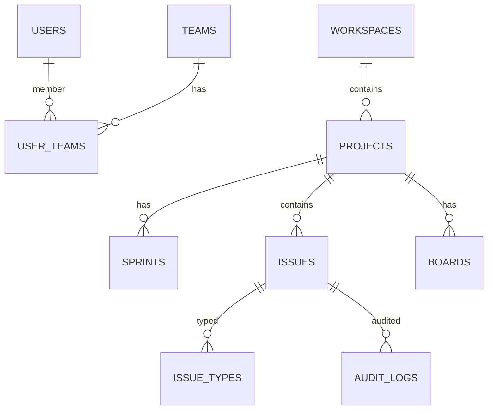

# SprintFlow Technical Architecture

## Introduction

### Background
SprintFlow (TELJIRAMonolith) is a monolithic web application providing Jira-like work management capabilities. The stack consists of:
- Frontend: React + Vite SPA served on port 5173 in development.
- Backend: Node.js (Express) API server with Swagger UI documentation, Socket.IO for real-time events, and PostgreSQL as the data store.
- Deployment: Backend listens on a configurable port (default 3000); frontend proxies /api and /docs to the backend in development.

### Scope
This document details the current technical architecture, including module structure, API surface, data schema, security model (RBAC and audit logging), real-time communication, extensibility points, and deployment considerations.

## System Architecture Overview

### High-Level View
- Client SPA (React) communicates with API via JSON over HTTPS and subscribes to Socket.IO for events (project and issue/sprint updates).
- Express application composes middleware for security, rate limiting, request context, authentication, RBAC, auditing, and routing.
- PostgreSQL provides persistence for users, roles/permissions, teams, workspaces, projects, sprints, issues, boards, audit logs, and webhook subscriptions.
- Swagger UI is mounted at /docs with dynamic server URL resolution.

### Component Structure
- src/app.js: Express application initialization, middleware, Swagger UI, CSRF logic, and route mounting.
- src/server.js: HTTP server bootstrap, DB initialization, Socket.IO initialization, and graceful shutdown.
- src/routes/: Route aggregator and feature route modules under modules/.
- src/middleware/: requestContext, auth (JWT), rbac (permission checks), audit (DB write), error handlers.
- src/db/: PostgreSQL pool initialization, migration, and seed scripts.
- src/utils/: crypto utilities (argon2, jwt) and structured logger (winston).
- src/socket/: Socket.IO server setup (rooms: global, project:{id}, user:{id}).

## Detailed Architecture

### Backend Modules

#### Application and Middleware
- Security and hardening:
  - Helmet for headers (CSP disabled to allow Swagger and local dev as configured).
  - CORS: allow-list includes local dev frontend; credentials enabled.
  - Rate limiting: API limited via express-rate-limit.
  - Compression: GZip responses.
  - Cookies: cookie-parser for CSRF token cookie when applicable.
- Request lifecycle:
  - requestContext: assigns a requestId and placeholder user, sets X-Request-Id.
  - Authentication: auth middleware extracts and verifies JWT from Authorization header; populates req.context.user.
  - RBAC: requirePermissions checks presence of required permission strings in req.context.user.permissions.
  - CSRF: enabled for browser requests without Authorization header; API clients with Authorization bypass CSRF.
  - Error handling: notFoundHandler and errorHandler provide consistent JSON responses with structured logging.

#### Routing and Features
- /api/auth: register and login, bcrypt/argon2 hashing with pepper; JWT issuance with roles/permissions placeholders.
- /api/users: list/get/delete users (requires user.read/user.write).
- /api/workspaces: create/list workspaces (settings.admin and project.read).
- /api/projects: create/list projects (project.write/read); emits project:created to global room.
- /api/issues: create/list/patch issues (issue.write/read); emits issue:created and issue:updated to project rooms; sequential per-project key generation.
  - Internals refactored: IssueService encapsulates creation, update, transition, linking (stub), and deletion. Routes delegate to service for maintainability.
- /api/sprints: create sprints and update state; emits sprint:created; audits actions.
- /api/boards: create/list boards (board.write/read).
- /api/backlog: list backlog issues for project (no sprint assigned).
- /api/rbac: list roles and permissions (rbac.manage).
- /api/reports: summary report placeholder for counts.
- /api/settings: returns basic accessibility/security configuration placeholders.
- /api/webhooks: accepts inbound webhooks, verifies HMAC signature if secret configured.

#### Real-Time Events
- Socket.IO rooms:
  - global: general events such as project:created.
  - project:{projectId}: project-scoped events like issue:created, issue:updated, sprint:created.
  - user:{userId}: reserved for future per-user notifications.
- Client connects to ws://host:3000 and subscribes implicitly to global; custom joins for project rooms are available via join:project events.

### Data Architecture

#### Database
- PostgreSQL with pgcrypto extension enabled for UUID generation.
- Core tables:
  - users, roles, permissions, role_permissions
  - teams, user_teams
  - workspaces, projects
  - sprints
  - issue_types, issues
  - boards
  - audit_logs
  - webhook_subscriptions
- Selected constraints:
  - projects unique (workspace_id, key)
  - issues unique per project on (project_id, key)
- Seed defaults:
  - issue_types: task, bug, story
  - roles and permissions arrays as listed

#### ER Model (Conceptual)

Note: The above reflects implemented tables; additional entities like comments/attachments/changelogs are future scope.

### API Architecture

- OpenAPI via swagger-jsdoc aggregates JSDoc annotations from routes and controllers.
- Swagger UI served at /docs with dynamic server URL computation based on request host/protocol/port.

Example security scheme:
- bearerAuth with HTTP bearer JWT; global security applied.

Representative endpoints implemented:
- POST /api/auth/register, /api/auth/login
- POST/GET /api/workspaces, /api/projects
- POST/GET/PATCH /api/issues, GET /api/backlog
- POST/PATCH /api/sprints
- POST/GET /api/boards
- GET /api/rbac/roles, /api/rbac/permissions
- GET /api/reports/summary
- GET /api/settings
- POST /api/webhooks

### Frontend Architecture

- Vite + React SPA with routes:
  - /login: handles login/registration.
  - /: dashboard lists projects.
  - /projects: list and create projects; fetch workspaces; requires token.
  - /issues: list and create issues by project; requires token.
- Authentication:
  - Token persisted in localStorage; presence guards routes.
- Real-time:
  - Socket.IO client connects on login; listens for project:created alerts (demo).
- Accessibility:
  - Semantic landmarks for header, nav, main, footer; labeled form controls; aim for WCAG 2.2 AA.

## Security Architecture

### Authentication and Authorization
- JWT-based auth; token signed with JWT_SECRET and optional expiry via JWT_EXPIRES_IN.
- Authorization enforced via requirePermissions middleware; current tokens include minimal permissions; future enhancement to load from DB mappings.

### RBAC Model
- Tables: roles, permissions, role_permissions; user_teams and workspace/project scoping to be expanded for effective permissions.
- Seed permissions cover user/project/issue/board/sprint/settings/rbac operations.

### Audit and Observability
- auditLog middleware writes actor_id, action, resource_type/id, metadata, IP, and user_agent to audit_logs.
- Logging with winston in JSON; includes timestamps, stack traces.
- Health endpoint at root path returns status, timestamp, and environment.

### Network and App Security
- Helmet for sensible defaults (CSP disabled due to dev constraints); consider tightening in production.
- CSRF protection for browser-origin requests without Authorization; API clients with Authorization bypass CSRF.
- Rate limiting on /api; CORS allowlist includes dev origins and optional SITE_URL from env.
- Cookie secret for signing CSRF cookie.

## Extensibility

### Webhooks
- Inbound webhooks: POST /api/webhooks with optional HMAC signature verification.
- Outbound webhooks: placeholder table webhook_subscriptions; future publishers can emit events for integrations.

### Automation and Rules
- Placeholder endpoints for automation rules; future design to trigger on create/update/transition/time-based events.

### APIs and SDKs
- REST API documented via Swagger; generate client SDKs from openapi.json if needed (script provided: generate_openapi.js).

### Real-Time Events
- Socket.IO rooms provide hooks for UI updates and external consumers via adapters, enabling scalable pub/sub in future.

## Deployment Considerations

### Configuration
- Environment variables:
  - PORT, HOST, SITE_URL
  - PGHOST, PGPORT, PGDATABASE, PGUSER, PGPASSWORD, PGSSLMODE
  - JWT_SECRET, JWT_EXPIRES_IN
  - PASSWORD_PEPPER, COOKIE_SECRET
  - WEBHOOK_SECRET (for inbound verification)
  - NODE_ENV
- Scripts:
  - npm run migrate, npm run seed
  - npm run dev (backend), npm --prefix frontend run dev (frontend)
  - npm run build:openapi (generate interfaces/openapi.json)

### Scaling and Operations
- Monolithic process with Socket.IO; can scale vertically or with sticky sessions; consider Socket.IO adapter (e.g., Redis) for horizontal scaling.
- Postgres connection pool configured with sane defaults; monitor and tune based on load.
- Graceful shutdown traps SIGTERM/SIGINT, closes HTTP server and DB connections.

### Security Hardening (Production)
- Enforce HTTPS; set secure cookies; tighten CSP.
- Strict CORS to trusted origins; robust JWT rotation and revocation, MFA/SSO.
- Database migrations gated by CI/CD; secrets managed via vault.

## Compliance and Accessibility

### Compliance
- GDPR-readiness: export/delete endpoints and data lineage to be implemented; current audit logging retained per policy.
- Audit trail coverage includes auth, user, workspace, project, issue, sprint, and board operations where implemented.

### Accessibility
- Aim for WCAG 2.2 AA.
- Current frontend includes semantic roles and form labels; continue to add keyboard shortcuts and ARIA attributes for complex interactions (boards, dialogs).

## Future Work

- Workflow engine and schemes; richer issue model (comments, attachments, links, history).
- Full RBAC derivation from DB with permission schemes per project/workspace.
- Advanced reports and dashboards; SLA tracking and calendars.
- SSO/OIDC and MFA; API tokens.
- Notification integrations (email, Teams/Slack) and outbound webhooks.
- Expanded automation rules and scheduling.
- Internationalization and theming.

