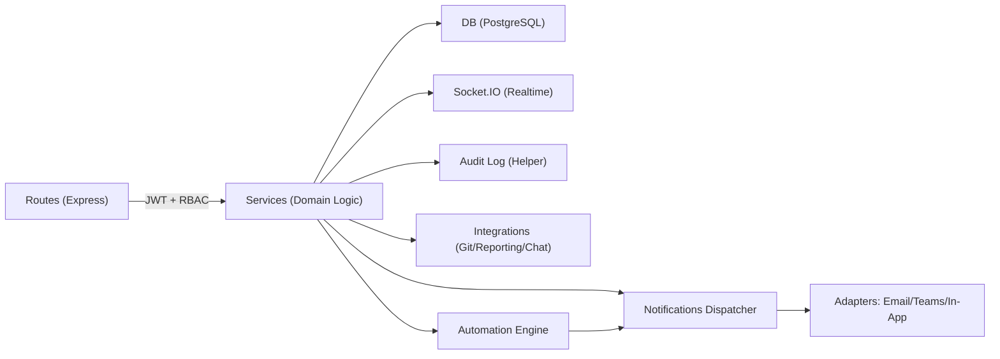

# TELJIRAMonolith Backend: Architecture, Modules, APIs, and Contributor Onboarding

## Introduction

### Background
The TELJIRA Monolith (also referred to as SprintFlow) is an Express.js and PostgreSQL–based backend that powers a Jira-like work management application. The backend exposes RESTful APIs consumed by a React frontend and integrates with external identity providers, notification channels, and third-party services to support core features such as authentication, projects, issues, boards, sprints, automation, reporting, settings, RBAC, notifications, and integrations.

### Scope
This document covers the backend service architecture, the updated modular service structure, component/service relationships, API surface areas (with OpenAPI/Swagger integration), environment configuration, and contributor onboarding. It summarizes recent refactors that move business logic from routes into cohesive service modules for maintainability and extensibility.

## Architecture Overview

### High-Level Design
The backend follows a modular monolith pattern:
- Express app (src/app.js) configures security middleware (helmet, rate limiting, CSRF), CORS, logging, routes, and Swagger UI.
- Routes are grouped under feature modules (src/routes/modules) and are intentionally thin. They handle:
  - Authentication/authorization (JWT + RBAC middleware)
  - Input validation (where applicable)
  - Calling service-layer functions
  - HTTP response shaping
- Service layers (src/services/...) encapsulate the business logic per domain. They handle:
  - Data access via PostgreSQL (src/db)
  - Domain rules and orchestration
  - Eventing/Socket.IO emissions
  - Best-effort audit logging
- OpenAPI schema is generated from JSDoc annotations across routes/controllers (swagger.js), exposed at /docs.
- Real-time updates use Socket.IO for board updates and general events.
- Cross-cutting concerns (audit logs, logger, request context, error handling) are centralized in middleware and utilities.

### Key Modules and Responsibilities
- Authentication and Users: Registration and login with JWT, optional OIDC (future-ready).
- RBAC: Permission resolution and enforcement via middleware and services.
- Issues: Creation, update, transitions, linking (stub), deletion.
- Sprints: Sprint lifecycle management and completion flow.
- Boards: Board CRUD, columns configuration, DnD operations, and realtime events.
- Automation: Rule evaluation engine with conditions and actions, including notifications.
- Notifications: Dispatcher with pluggable adapters (email, teams, in-app).
- Reports: Aggregation, formatting, and orchestration for project/sprint metrics.
- Settings: Read/validate/update global settings with audit.
- Integrations: Git/Reporting/Chat abstractions and routes.

## Updated Modular Service Structure

### Authentication
- Controller-Service split for maintainability:
  - src/controllers/auth.js handles validation and HTTP concerns.
  - src/services/auth.js encapsulates registration and login (DB, hashing, JWT, audit).
- Routes: src/routes/modules/auth.js provides /api/auth/register and /api/auth/login.

### RBAC
- Services: src/services/rbac
  - permissionService.js resolves and checks permissions.
  - roleService.js lists roles and permissions.
  - policyService.js evaluates higher-level policies (extensible).
- Middleware: src/middleware/rbac.js exports requirePermissions(...perms), resolving user permissions if not already present.
- Routes: src/routes/modules/rbac.js lists roles and permissions.

### Issues
- Service: src/services/issues/service.js
  - createIssue, listIssues, updateIssue, transitionIssue, linkIssues (stub), deleteIssue.
  - Emits Socket.IO events and writes audit logs.
- Routes: src/routes/modules/issues.js delegates to service methods with RBAC checks.

### Sprints
- Service: src/services/sprints/service.js
  - createSprint, updateSprintState, completeSprint, attachSprintToBoard (helper), getSprintsForProject.
- Routes: src/routes/modules/sprints.js delegate to service. Completion endpoint can be added as needed.

### Boards
- Services: src/services/boards
  - service.js: board CRUD
  - columnsService.js: column CRUD and ordering
  - dndService.js: drag-and-drop moves and reorder
  - realtimeService.js: Socket.IO helpers and emit logic
- Config model (MVP) stores columns and issue positions in board config JSON; future normalization planned.
- Routes: src/routes/modules/boards.js remains thin and documented.

### Automation
- Services: src/services/automation
  - engine.js: orchestration of rule retrieval, evaluation, and action execution
  - ruleEvaluator.js: filters/matches rules and delegates per-rule evaluation
  - conditionParser.js: parses and evaluates simple condition expressions
  - actionExecutor.js: executes actions (notify, update_field placeholder, call_webhook placeholder)
- Integration: Other modules (e.g., issues) can call AutomationEngine.evaluateAndExecute(ctx, event).

### Notifications
- Dispatcher: src/services/notifications/dispatcher.js
  - dispatch(req, payload) validates, formats via adapters, sends, and audits.
  - Pluggable adapters: emailAdapter.js, teamsAdapter.js, inAppAdapter.js.
  - Emits generic Socket.IO observability events when available.
- Route: src/routes/modules/notifications.js exposes POST /api/notifications/dispatch with JWT + RBAC.

### Reports
- Module: src/services/reports
  - aggregator.js: DB access and metric computations (e.g., getProjectSummary).
  - formatter.js: pure formatting to JSON/CSV.
  - service.js: orchestrates and returns report results to routes.

### Settings
- Module: src/services/settings
  - retrievalService.js: getGlobalSettings (with sane defaults and merge).
  - validationService.js: validateSettingsPayload (pure).
  - updateService.js: updateGlobalSettings (validate, merge, persist, audit).
- Route: src/routes/modules/settings.js (GET, PATCH) with RBAC.

### Integrations
- Module: src/services/integrations (+ subfolders)
  - git/service.js: linkPullRequest, getCommitsForIssue, validateSignature.
  - reporting/service.js: fetchExternalReport.
  - chat/service.js: handleInboundWebhook, postMessage.
- Route: src/routes/modules/integrations.js for git/reporting/chat endpoints.

## Component and Service Relationships

- Routes -> Services: Routes authenticate and authorize requests, then call service methods. This keeps HTTP concerns (status codes, validation) in routes/controllers and domain logic in services.
- Services -> DB: Services access PostgreSQL via src/db/index.js (initDb/getDb), using environment-driven config.
- Services -> Socket.IO: Real-time updates are emitted via Socket.IO (e.g., boards, issues, notifications).
- Services -> Audit: Mutation flows attempt to audit actions using auditLog helper (non-throwing).
- Automation -> Notifications: Automation actions can call Notification Dispatcher to alert users/channels.
- Integrations -> External Providers: Integration services encapsulate provider-specific logic behind domain-oriented functions.

## OpenAPI and API Usage

### Swagger/OpenAPI Setup
- swagger.js configures swagger-jsdoc with:
  - JWT Bearer security scheme (bearerAuth)
  - Global security requirement
  - Tags for key modules (Health, Auth, Users, Teams, RBAC, Workspaces, Projects, Boards, Sprints, Issues, Backlog, Automation, Reports, Settings, Webhooks, Notifications)
- JSDoc annotations are gathered from:
  - ./src/routes/**/*.js
  - ./src/controllers/**/*.js
- Docs served at /docs (see top-level README steps).

### Example Endpoints and Tags
- Auth (tag: Auth)
  - POST /api/auth/register (controller: src/controllers/auth.js, route: src/routes/modules/auth.js)
  - POST /api/auth/login
- Notifications (tag: Notifications)
  - POST /api/notifications/dispatch: Protected by JWT + requirePermissions("notifications.send"), dispatches via dispatcher.
- Integrations (tag: Webhooks/Integrations/Reports)
  - POST /api/integrations/git/link-pr
  - GET /api/integrations/git/commits
  - GET /api/integrations/reporting/external
  - POST /api/integrations/chat/inbound
  - POST /api/integrations/chat/post
- Automation (tag: Automation)
  - GET /api/automation/rules
  - POST /api/automation/evaluate

Note: Additional modules (boards, issues, sprints, settings, etc.) are similarly documented via JSDoc in their route files. Run npm run build:openapi to regenerate the spec if needed.

## Environment Configuration

### .env
The application reads environment variables via dotenv. Copy .env.example to .env and set values appropriate to your environment. Common keys:
- Server
  - PORT, HOST, NODE_ENV, APP_NAME, SITE_URL
- Security
  - JWT_SECRET, JWT_EXPIRES_IN, COOKIE_SECRET, PASSWORD_PEPPER, CSRF_COOKIE_NAME
- Database (PostgreSQL)
  - PGHOST, PGPORT, PGDATABASE, PGUSER, PGPASSWORD, PGSSLMODE
- OIDC/SSO (optional/future-ready)
  - OIDC_ISSUER_URL, OIDC_CLIENT_ID, OIDC_CLIENT_SECRET, OIDC_REDIRECT_URI
- Email/Notifications
  - NOTIFY_PROVIDER, SMTP_HOST, SMTP_PORT, SMTP_USER, SMTP_PASS, FROM_EMAIL
- Webhook signing
  - WEBHOOK_SECRET

Database connections are initialized in src/db/index.js using these variables (with optional SSL mode based on PGSSLMODE).

## Contributor Onboarding

### Prerequisites
- Node.js >= 18.18.0
- PostgreSQL reachable locally or remotely
- npm

### Setup
1. Copy environment:
   - cd TELJIRAMonolith
   - cp .env.example .env
   - Fill DB and JWT settings.
2. Install dependencies:
   - npm install
3. Database:
   - npm run migrate
   - npm run seed
4. Start backend:
   - npm run dev
5. Start frontend:
   - npm run --prefix frontend dev
6. Access:
   - Frontend: http://localhost:5173
   - API docs: http://localhost:3000/docs
   - Health: GET http://localhost:3000/

### Auth and RBAC
- Register via POST /api/auth/register, then login via POST /api/auth/login.
- Use Bearer token for protected endpoints.
- RBAC is enforced via middleware. During development, seed data configures default roles/permissions; adjust as needed.

### Code Structure and Conventions
- Keep routes thin. Add/extend business logic in services under src/services/<module>.
- When adding new endpoints:
  - Add routes with JSDoc OpenAPI annotations.
  - Enforce authentication and permissions in routes.
  - Implement service functions with clear PUBLIC_INTERFACE comments.
  - Emit real-time updates via Socket.IO only when needed.
  - Audit mutating actions using best-effort helpers.
- Logging: Use src/utils/logger.js (Winston) for structured logs.

### Running Tests and Lint
- Lint: npm run lint
- Tests: npm test (Jest; add service-level tests for new modules)

## Module Deep Dives

### Notifications Dispatcher
- Location: src/services/notifications/dispatcher.js
- Responsibility: Validate payloads, format messages via adapters (email, teams, in-app), send, and audit results. Emits a global Socket.IO event for observability if available.
- Route: POST /api/notifications/dispatch (requires JWT and permissions).
- Extensibility: Add adapters under src/services/notifications/adapters and register under constructor.

### Automation Engine
- Location: src/services/automation
- Responsibility: Evaluate rules against events, invoke actions (e.g., notifications).
- Invocation: Internal modules (e.g., issues create/update) can call AutomationEngine.evaluateAndExecute(req, event).

### Boards and Realtime
- Board CRUD, columns, and DnD moved to dedicated services under src/services/boards. Real-time events use rooms such as board:{boardId} and project:{projectId}.

### Issues Lifecycle
- Issue creation, update, transition, link (stub), and delete centralized in src/services/issues/service.js. Emits Socket.IO updates and writes audit logs.

### Sprints Lifecycle
- Sprint creation, state updates, and completion flows handled in src/services/sprints/service.js with room to evolve moving incomplete issues.

### Reports
- Aggregation (DB) and formatting (JSON/CSV) are separated under src/services/reports, with service orchestration entry points.

### Settings
- Retrieval, validation, and update separated, with PATCH /api/settings guarded by RBAC and audited.

### Integrations
- Git/reporting/chat integration logic isolated behind provider-agnostic interfaces. Webhook validation helpers included.

## OpenAPI Generation and Usage

### Generation
- Build OpenAPI: npm run build:openapi (runs generate_openapi.js).
- The swagger.js file defines base configuration and scans routes/controllers for annotations.

### Viewing
- Start backend and visit /docs for Swagger UI.

### Example OpenAPI Annotation (excerpt)
Routes like src/routes/modules/auth.js document request/response schemas. Ensure new endpoints include similar annotations for discoverability and client generation.

## Architecture Changes and Benefits

### Summary of Changes
- Route-to-service refactor across major domains: auth, RBAC, issues, sprints, boards, automation, reports, settings, notifications, integrations.
- Introduction of PUBLIC_INTERFACE documentation within services to formalize service contracts.
- Consolidation of audit logging as best-effort within services.
- OpenAPI integration tightened via swagger.js with comprehensive tags and JWT security scheme.

### Benefits
- Maintainability: Clear separation of concerns simplifies reasoning and reduces coupling. Services are easier to unit test and evolve.
- Extensibility: Adding new features (e.g., a notification channel, an automation action, or a board capability) can be done by extending the relevant module without invasive route changes.
- Consistency: Centralized error handling, permissions, audit, and logging patterns reduce drift and bugs.
- Observability: Common logging and Socket.IO events improve troubleshooting of flows like notifications and board updates.
- Compliance & Security: RBAC and audit are consistently enforced; secrets are provided via environment variables.

## Frontend Integration Notes
- The React frontend (TELJIRAMonolith/frontend) consumes the REST APIs served by the backend.
- Real-time updates (e.g., board changes, notifications) are delivered via Socket.IO rooms; ensure the frontend joins the appropriate rooms (board:{boardId}, project:{projectId}, or global where applicable).
- API base is typically /api/<module>; consult /docs to explore endpoints interactively.

## Appendix

### Mermaid: Module Interaction Diagram

### Quick Reference: Scripts
- Start backend: npm run dev
- Start frontend: npm run --prefix frontend dev
- Migrate DB: npm run migrate
- Seed DB: npm run seed
- Build OpenAPI: npm run build:openapi
- Lint: npm run lint
- Test: npm test

## Conclusion

### Summary
The TELJIRA Monolith backend has been refactored into a clean modular service structure that separates HTTP concerns from domain logic, standardizes audit and RBAC enforcement, and integrates OpenAPI documentation for discoverability. This modular approach significantly improves maintainability, testability, and extensibility across critical domains such as issues, sprints, boards, automation, reports, settings, notifications, and integrations. With clear onboarding steps and environment configuration, contributors can quickly become productive and confidently extend the system.
