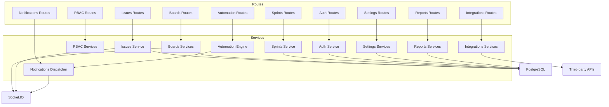

# TELJIRAMonolith Service Module Reference and API Surface

## Introduction

### Background
This companion document to the Backend Architecture guide provides a service-by-service reference of the TELJIRA Monolith backend. It outlines public service interfaces, their primary responsibilities, and the corresponding API endpoints, including OpenAPI tag mappings for discoverability in Swagger UI.

### Scope
Covers services under src/services and their linked routes under src/routes/modules, environment/config notes where relevant, and guidance for extending modules safely.

## Service Modules and Public Interfaces

### Auth Service

#### Responsibilities
- Handle user registration and login.
- Manage credential hashing, JWT issuance, and audit logging.

#### Key Files
- Controller: src/controllers/auth.js
- Service: src/services/auth.js
- Route: src/routes/modules/auth.js

#### Public Interface (Controller + Service)
- registerValidation(), loginValidation()
- register(req, { email, name, password })
- login(req, { email, password })

#### API Endpoints (OpenAPI tag: Auth)
- POST /api/auth/register
- POST /api/auth/login

#### Env/Config
- JWT_SECRET, JWT_EXPIRES_IN, PASSWORD_PEPPER
- PostgreSQL variables for persistence

---

### RBAC Services

#### Responsibilities
- Resolve user permissions from roles.
- Check permissions and evaluate policies.

#### Key Files
- src/services/rbac/permissionService.js
- src/services/rbac/roleService.js
- src/services/rbac/policyService.js
- Middleware: src/middleware/rbac.js
- Route: src/routes/modules/rbac.js

#### Public Interface
- permissionService.checkPermissions(user, requiredPermissions)
- permissionService.resolveUserPermissions(user)
- roleService.listRoles(), roleService.listPermissions()
- policyService.evaluatePolicy(user, policy, context?)

#### API Endpoints (OpenAPI tag: RBAC)
- GET /api/rbac/roles
- GET /api/rbac/permissions

#### Notes
- Middleware requirePermissions(...perms) guards API routes.

---

### Issues Service

#### Responsibilities
- Issue lifecycle operations and audit.
- Socket.IO emissions for real-time updates.

#### Key Files
- src/services/issues/service.js
- Route: src/routes/modules/issues.js

#### Public Interface
- createIssue(req, { project_id, sprint_id?, type_id?, title, description?, priority? })
- listIssues(req, { project_id?, sprint_id? })
- updateIssue(req, { issue_id, fields })
- transitionIssue(req, { issue_id, to_status })
- linkIssues(req, { source_id, target_id, type }) [stub]
- deleteIssue(req, { issue_id })

#### API Endpoints (OpenAPI tag: Issues)
- POST /api/issues
- GET /api/issues
- PATCH /api/issues/{id}
- POST /api/issues/{id}/transition
- POST /api/issues/link
- DELETE /api/issues/{id}

---

### Sprints Service

#### Responsibilities
- Create and manage sprints; completion workflow.

#### Key Files
- src/services/sprints/service.js
- Route: src/routes/modules/sprints.js

#### Public Interface
- createSprint(req, { project_id, name, goal?, start_date?, end_date? })
- updateSprintState(req, { sprint_id, state })
- completeSprint(req, { sprint_id, move_incomplete? })
- attachSprintToBoard(req, { board_id, sprint_id })
- getSprintsForProject(req, { project_id })

#### API Endpoints (OpenAPI tag: Sprints)
- POST /api/sprints
- PATCH /api/sprints/{id}
- POST /api/sprints/{id}/complete (if enabled)

---

### Boards Services

#### Responsibilities
- Board CRUD, columns management, drag-and-drop, and realtime emissions.

#### Key Files
- src/services/boards/service.js
- src/services/boards/columnsService.js
- src/services/boards/dndService.js
- src/services/boards/realtimeService.js
- Route: src/routes/modules/boards.js

#### Public Interface
- Board: createBoard, listBoards, getBoardById
- Columns: listColumns, createColumn, updateColumnOrder, deleteColumn
- DnD: moveIssue, reorderIssue
- Realtime: getBoardRoom, emitBoardEvent

#### API Endpoints (OpenAPI tag: Boards)
- POST /api/boards, GET /api/boards, GET /api/boards/{id}
- GET /api/boards/{id}/columns
- POST /api/boards/{id}/columns
- PATCH /api/boards/{id}/columns/order
- DELETE /api/boards/{id}/columns/{column_id}
- POST /api/boards/{id}/dnd/move
- POST /api/boards/{id}/dnd/reorder

---

### Automation Engine

#### Responsibilities
- Evaluate rules and execute actions for incoming events.

#### Key Files
- src/services/automation/engine.js
- src/services/automation/ruleEvaluator.js
- src/services/automation/conditionParser.js
- src/services/automation/actionExecutor.js
- Route: src/routes/modules/automation.js

#### Public Interface
- evaluateAndExecute(req, event)
- getRulesForScope(ctx?) [implementation detail]

#### API Endpoints (OpenAPI tag: Automation)
- GET /api/automation/rules
- POST /api/automation/evaluate

---

### Notifications Dispatcher

#### Responsibilities
- Validate, format, and dispatch notifications via channel adapters.
- Audit dispatch attempts and outcomes; optional realtime observability.

#### Key Files
- src/services/notifications/dispatcher.js
- adapters: emailAdapter.js, teamsAdapter.js, inAppAdapter.js
- Route: src/routes/modules/notifications.js

#### Public Interface
- dispatch(req, { event_type, recipients[], channels[], data, priority?, metadata? })

#### API Endpoints (OpenAPI tag: Notifications)
- POST /api/notifications/dispatch

#### Security
- JWT + requirePermissions("notifications.send")

---

### Reports Module

#### Responsibilities
- Aggregate metrics and format output for API.

#### Key Files
- src/services/reports/aggregator.js
- src/services/reports/formatter.js
- src/services/reports/service.js
- Route: src/routes/modules/reports.js

#### Public Interface
- getProjectSummaryReport(req, { project_id, format? })
- getSprintBurndownReport(req, { sprint_id, format? }) [placeholder]

#### API Endpoints (OpenAPI tag: Reports)
- GET /api/reports/project-summary
- GET /api/reports/sprint-burndown

---

### Settings Module

#### Responsibilities
- Retrieve, validate, and update global settings with audit.

#### Key Files
- src/services/settings/retrievalService.js
- src/services/settings/validationService.js
- src/services/settings/updateService.js
- Route: src/routes/modules/settings.js

#### Public Interface
- getGlobalSettings()
- validateSettingsPayload(payload)
- updateGlobalSettings(req, { patch })

#### API Endpoints (OpenAPI tag: Settings)
- GET /api/settings
- PATCH /api/settings

#### Security
- requirePermissions("settings.admin")

---

### Integrations Layer

#### Responsibilities
- Provide provider-agnostic interfaces for Git, reporting APIs, and chat/webhook interactions.

#### Key Files
- src/services/integrations/index.js
- src/services/integrations/git/service.js
- src/services/integrations/reporting/service.js
- src/services/integrations/chat/service.js
- Route: src/routes/modules/integrations.js

#### Public Interface
- gitService.linkPullRequest(req, { issue_key, pr_url, provider?, metadata? })
- gitService.getCommitsForIssue(req, { issue_key, provider?, since?, until? })
- reportingApiService.fetchExternalReport(req, { report_type, params, format? })
- chatService.handleInboundWebhook(req, { provider, payload })
- chatService.postMessage(req, { provider, target, message, options? })

#### API Endpoints (OpenAPI tags: Integrations, Webhooks)
- POST /api/integrations/git/link-pr
- GET /api/integrations/git/commits
- GET /api/integrations/reporting/external
- POST /api/integrations/chat/inbound
- POST /api/integrations/chat/post

---

## OpenAPI Tag Mapping

- Health: / (src/routes/health.js)
- Auth: /api/auth/*
- Users, Teams: /api/users/*, /api/teams/* (if present)
- RBAC: /api/rbac/*
- Workspaces, Projects: /api/workspaces/*, /api/projects/*
- Boards: /api/boards/*
- Sprints: /api/sprints/*
- Issues: /api/issues/*
- Backlog: /api/backlog/*
- Automation: /api/automation/*
- Reports: /api/reports/*
- Settings: /api/settings/*
- Webhooks: /api/webhooks/*
- Notifications: /api/notifications/*
- Integrations: /api/integrations/*

Swagger UI is available at /docs. The configuration resides in swagger.js and scans ./src/routes/**/*.js and ./src/controllers/**/*.js for annotations. Use npm run build:openapi to rebuild the spec where needed.

## Configuration Matrix

### Server and Security
- PORT, HOST, NODE_ENV, APP_NAME, SITE_URL
- JWT_SECRET, JWT_EXPIRES_IN, COOKIE_SECRET, PASSWORD_PEPPER, CSRF_COOKIE_NAME

### Database
- PGHOST, PGPORT, PGDATABASE, PGUSER, PGPASSWORD, PGSSLMODE
- Connection pool initialized via src/db/index.js

### Identity (Optional/OIDC)
- OIDC_ISSUER_URL, OIDC_CLIENT_ID, OIDC_CLIENT_SECRET, OIDC_REDIRECT_URI

### Notifications/Email
- NOTIFY_PROVIDER, SMTP_HOST, SMTP_PORT, SMTP_USER, SMTP_PASS, FROM_EMAIL

### Webhooks
- WEBHOOK_SECRET

## Extensibility Guidelines

### Adding a New Service Function
1. Implement business logic in src/services/<module>/..., document PUBLIC_INTERFACE.
2. Update or add route handlers under src/routes/modules with:
   - JWT auth, RBAC via requirePermissions
   - Input validation (e.g., express-validator in controller)
   - JSDoc OpenAPI annotation (summary, requestBody, responses, tags)
3. Add unit tests (Jest) at service level.
4. Update docs if surface changes.

### Adding a New Notification Channel
1. Create a new adapter under src/services/notifications/adapters/<channel>Adapter.js.
2. Implement format() and send() with consistent return shapes and error handling.
3. Register adapter in NotificationDispatcher constructor or via injection.
4. Update permissions, .env if new configuration is required.
5. Extend OpenAPI notes under Notifications if exposing additional HTTP endpoints.

## Mermaid: Service-to-Route and Cross-Cutting Concerns

## Conclusion

### Summary
This reference consolidates the public interfaces of each service module, the corresponding API endpoints, and the configuration implications. Use it alongside the Architecture and Onboarding guide to quickly navigate the codebase, extend features safely, and keep the API documentation in sync via OpenAPI annotations.
